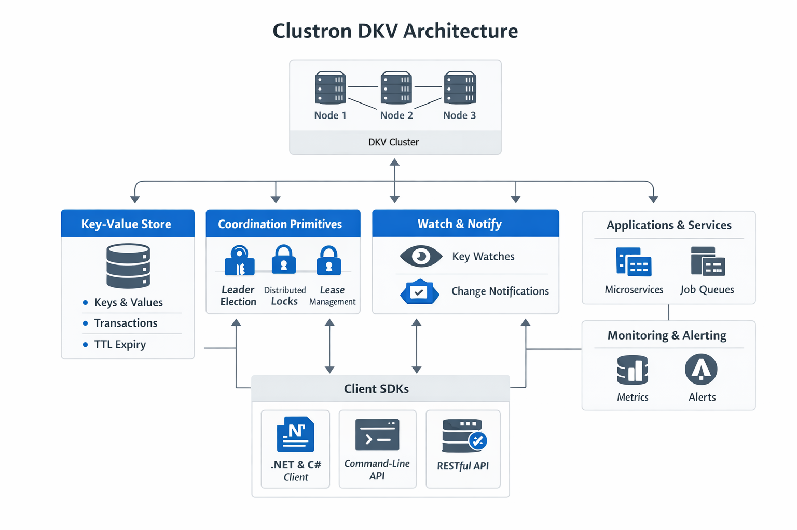

# Building Distributed Systems
*A Practical Guide for .NET Developers*

## Introduction

Most backend systems begin their life on a single machine.

An ASP.NET Core application processes requests, a database stores application data, and background workers handle asynchronous tasks such as sending emails or generating reports. In this environment, concurrency is manageable and coordination between components is relatively straightforward.

As the system grows, however, things start to change.

Traffic increases, more application instances are deployed behind a load balancer, and services begin running across multiple machines. What was once a single application evolves into a distributed system.

At this point, the nature of the problem changes dramatically.

The challenges are no longer limited to writing correct business logic. Developers must now deal with coordination across machines, network failures, partial outages, and maintaining consistency across distributed state.

This is where distributed systems engineering begins.

---

---

## What Is a Distributed System?

A distributed system is a collection of independent computers that appear to the user as a single coherent system.

Instead of running all logic on one machine, responsibilities are distributed across multiple nodes that communicate over the network.

Examples include:

- Microservice architectures
- Distributed databases
- Clustered caches
- Message queues
- Cloud infrastructure platforms

These systems provide scalability and resilience but introduce new complexities.

---

## Why Distributed Systems Are Hard

Unlike a single-machine application, distributed systems must deal with realities such as:

### Network Failures

In distributed systems, communication happens over a network. Networks can be slow, unreliable, or temporarily unavailable.

A request may fail because the remote node crashed, because the network dropped packets, or because a timeout occurred.

The system must handle these scenarios gracefully.

---

### Partial Failures

In a distributed system, components can fail independently.

One node in a cluster might crash while others remain healthy. A service instance may restart while other services continue running.

This means the system must operate correctly even when only part of it is functioning.

---

### Consistency Challenges

When data is replicated across multiple nodes, keeping it consistent becomes difficult.

For example:

- Two nodes may attempt to update the same data simultaneously.
- Network delays may cause nodes to temporarily disagree about the current state.
- A node might crash after performing only part of an operation.

Designing systems that maintain consistent state despite these scenarios requires careful coordination.

---

## Key Building Blocks of Distributed Systems

Most distributed systems rely on a few core primitives.

Understanding these primitives helps developers design reliable architectures.

---

### Distributed Storage

Data must often be stored across multiple machines.

This enables:

- horizontal scaling
- fault tolerance
- high availability

Distributed key-value stores are commonly used for this purpose.

---

### Coordination

Nodes must coordinate actions such as:

- leader election
- distributed locking
- cluster membership
- configuration updates

Without coordination mechanisms, multiple nodes might attempt conflicting operations.

---

### Consensus

Some systems require strong guarantees about shared state.

Consensus algorithms such as **Raft** or **Paxos** allow nodes to agree on decisions even in the presence of failures.

These algorithms are fundamental to distributed databases and coordination services.

---

### Partitioning and Replication

Data is typically:

- **partitioned** across nodes to distribute load
- **replicated** to protect against failures

Balancing performance, availability, and consistency is one of the core design challenges.

---

## Common Distributed System Patterns

Several patterns appear repeatedly in real-world systems.

Examples include:

- Leader election for coordinating cluster activities
- Distributed locks for ensuring mutual exclusion
- Job queues for asynchronous processing
- Rate limiters for controlling request volume
- Transaction protocols for atomic multi-node updates

These patterns form the foundation of many large-scale platforms.

---

## The Role of Coordination Systems

To simplify distributed development, many organizations rely on coordination systems such as:

- etcd
- ZooKeeper
- Consul

These systems provide primitives such as:

- leader election
- distributed locks
- cluster membership
- configuration storage

Applications can then build higher-level behavior on top of these primitives.

---

## Distributed Systems in the .NET Ecosystem

While distributed infrastructure tools are often associated with other ecosystems, .NET applications increasingly operate in distributed environments.

Modern .NET systems frequently use:

- Kubernetes
- distributed caches
- microservices
- event-driven architectures

As a result, coordination and distributed state management are becoming increasingly important for .NET developers as well.

---

## Final Thoughts

Building distributed systems is fundamentally different from building traditional single-machine applications.

The challenges of network communication, partial failures, and data consistency introduce complexities that require specialized patterns and infrastructure.

Fortunately, by understanding the key building blocks — storage, coordination, consensus, and replication — developers can design systems that scale reliably and remain resilient in the face of failures.

In future articles, we will explore some of these primitives in more detail, including leader election, distributed coordination patterns, and practical implementations in .NET.
