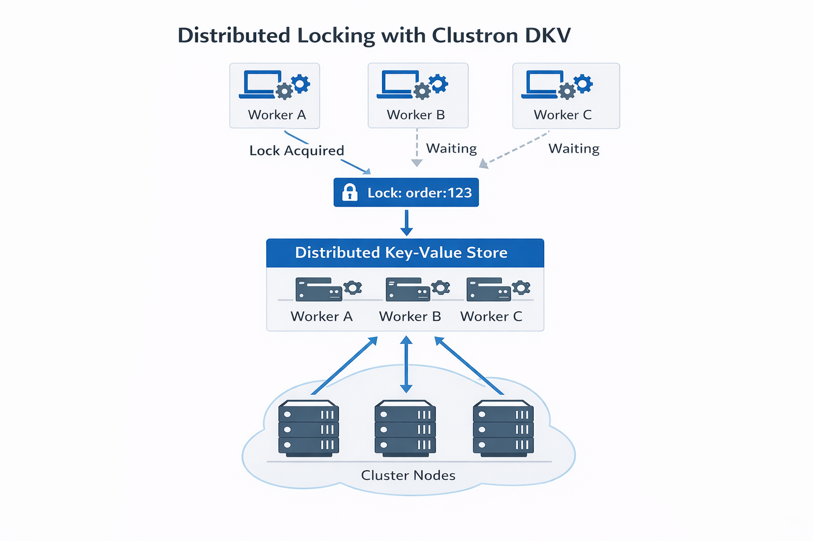

---
authors:
- clustron
slug: distributed-locks-explained
tags:
- distributed-systems
- distributed-locks
- dotnet
title: Distributed Locks Explained
---

# Distributed Locks Explained

*A Practical Guide for .NET Developers*

## Introduction

As applications scale across multiple machines, coordination becomes one
of the most challenging aspects of system design.

In a single-machine application, mutual exclusion is straightforward.
Developers can rely on language primitives such as `lock` in C#,
`Mutex`, or `Semaphore` to ensure that only one thread accesses a shared
resource at a time.

However, these primitives only work **within a single process or
machine**.

Once applications run across multiple services or nodes, traditional
locking mechanisms no longer work. Two services running on different
machines cannot rely on a local `lock` statement to coordinate access to
shared state.

This is where **distributed locks** become essential.

Distributed locks allow services across a cluster to coordinate access
to shared resources while ensuring that only one participant holds the
lock at a given time.

------------------------------------------------------------------------

## Local Locks vs Distributed Locks

A typical local lock in C# looks like this:

``` csharp
private static readonly object _lock = new object();

public void ProcessOrder()
{
    lock(_lock)
    {
        Console.WriteLine("Processing order safely.");
    }
}
```

This works perfectly **inside a single process**.

However, if your application runs on **multiple service instances**,
each instance has its own `_lock` object. The lock no longer coordinates
work across the system.

    Worker A → lock acquired
    Worker B → lock acquired
    Worker C → lock acquired

All workers proceed simultaneously, defeating the purpose of locking.

Distributed systems require a **shared coordination mechanism**.

------------------------------------------------------------------------



------------------------------------------------------------------------

## The Idea Behind Distributed Locks

A distributed lock uses a **shared system** to represent lock ownership.

Instead of locking memory, a node records lock ownership in a
distributed coordination system such as:

-   a distributed key‑value store
-   a coordination service
-   a distributed cache

Example concept:

    Lock Key: order:123
    Owner: worker‑1

If another worker attempts to acquire the same lock, the operation fails
until the lock is released or expires.

------------------------------------------------------------------------

## Real World Scenario: Distributed Invoice Processing

Imagine a cluster of workers processing invoices.

    Worker A
    Worker B
    Worker C

All workers scan for pending invoices.

Without locking:

    Worker A → processes invoice #101
    Worker B → processes invoice #101
    Worker C → processes invoice #101

The same invoice could be processed multiple times.

A distributed lock ensures that **only one worker processes the
invoice**.

------------------------------------------------------------------------

## Distributed Locks with Clustron DKV

Clustron DKV provides built‑in primitives for distributed coordination.

Locks are managed through the **Locks API**, and operations on locked
keys must include the correct **lock handle**.

------------------------------------------------------------------------

## Acquiring a Lock

A client first acquires a lock for a specific key.

``` csharp
var locks = ((IDkv)client).Locks;

var key = "order:123";

var lockHandle = await locks.AcquireAsync(key, TimeSpan.FromSeconds(10));

if (lockHandle == null)
{
    Console.WriteLine("Failed to acquire lock.");
    return;
}

Console.WriteLine("Lock acquired.");
```

The returned **lock handle** represents ownership of the lock.

------------------------------------------------------------------------

## Performing Operations Under the Lock

Once a lock is acquired, operations must include the lock handle.

``` csharp
var result = await client.PutAsync(
    key,
    "processed",
    Put.WithLock(lockHandle.Handle));

if (result.IsSuccess)
{
    Console.WriteLine("Value updated safely.");
}
```

Only the lock owner can modify the value.

------------------------------------------------------------------------

## Reading with the Lock

Reads can also respect the lock ownership.

``` csharp
var value = await client.GetAsync<string>(
    key,
    Get.WithLock(lockHandle.Handle));

if (value.IsSuccess)
{
    Console.WriteLine($"Value: {value.Value}");
}
```

------------------------------------------------------------------------

## Competing Operations Without the Lock

If another worker attempts to modify the key without the lock, the
operation fails.

``` csharp
var attempt = await client.PutAsync(key, "new-value");

if (!attempt.IsSuccess)
{
    Console.WriteLine($"Operation rejected: {attempt.Status}");
}
```

Result:

    KvStatus.Locked

This prevents concurrent modification of the same resource.

------------------------------------------------------------------------

## Releasing the Lock

Once the work is finished, the lock can be released.

``` csharp
await lockHandle.ReleaseAsync();

Console.WriteLine("Lock released.");
```

After the lock is released, another worker may acquire it.

------------------------------------------------------------------------

## Example Cluster Workflow

    Worker A → Acquire Lock → Success
    Worker B → Acquire Lock → Failed
    Worker C → Acquire Lock → Failed

    Worker A → Update Key
    Worker A → Release Lock

Only one worker performs the operation, ensuring correctness.

------------------------------------------------------------------------

## Handling Failures

Locks in Clustron are **time‑bound**.

When acquiring a lock, a duration must be specified:

``` csharp
await locks.AcquireAsync(key, TimeSpan.FromSeconds(10));
```

If the client holding the lock crashes or disconnects, the lock
eventually expires, allowing another worker to acquire it.

This prevents locks from remaining permanently held.

------------------------------------------------------------------------

## Best Practices

When implementing distributed locks:

-   Keep critical sections short
-   Avoid global locks when possible
-   Partition locks by resource
-   Always design for failure scenarios

------------------------------------------------------------------------

## Final Thoughts

Distributed locks are one of the most fundamental coordination
primitives in distributed systems.

They allow services running across multiple machines to safely
coordinate access to shared resources while preserving system
correctness.

Platforms like **Clustron DKV** simplify this by providing built‑in
locking primitives, atomic operations, and strong consistency
guarantees.

In the next article, we will explore another essential distributed
systems primitive:

**Leader Election.**
