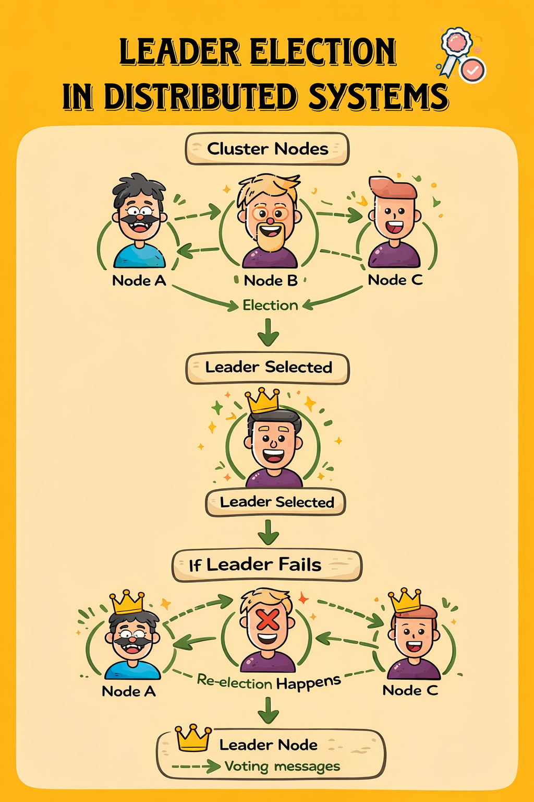

# Leader Election in Distributed Systems

When applications scale across multiple machines, coordination becomes
one of the hardest problems to solve.\
Distributed systems often run several identical nodes that can all
perform the same work. Without coordination, those nodes may attempt the
same task simultaneously, leading to duplicate work, race conditions, or
inconsistent state.

One of the most common ways to solve this problem is **leader
election**.

Leader election ensures that **one node temporarily becomes the leader**
while the other nodes remain followers. The leader performs coordination
tasks while followers wait for leadership to change.

This pattern is widely used in distributed databases, job schedulers,
container orchestration platforms, and configuration systems.

------------------------------------------------------------------------



------------------------------------------------------------------------

# A Simple Example

Imagine a distributed worker system with three nodes:

    Worker A
    Worker B
    Worker C

Each worker is capable of running background jobs.

If all workers execute the same scheduled job, the job will run three
times.\
Instead, we want **exactly one worker to run the job**.

This is where leader election becomes useful. One worker becomes the
**leader**, and only the leader runs the job.

------------------------------------------------------------------------

# The Simplest Leader Election Pattern

A common approach uses a **shared coordination store**.

The idea is simple:

1.  Each node attempts to acquire leadership.
2.  The node that succeeds becomes the leader.
3.  The leader periodically renews its leadership.
4.  If the leader fails, another node takes over.

This is typically implemented using a **lease**.

A lease acts like a lock with an expiration time. If the node holding
the lease disappears, another node can safely acquire leadership.

------------------------------------------------------------------------

# A Minimal .NET Example

The following simplified example demonstrates the idea behind
lease-based leadership.

``` csharp
public class LeaderElection
{
    private readonly ILeaseStore _store;
    private readonly string _nodeId;

    public LeaderElection(ILeaseStore store, string nodeId)
    {
        _store = store;
        _nodeId = nodeId;
    }

    public async Task RunAsync()
    {
        while (true)
        {
            var acquired = await _store.TryAcquireLeaseAsync("cluster-leader", _nodeId, TimeSpan.FromSeconds(10));

            if (acquired)
            {
                Console.WriteLine($"{_nodeId} is leader");

                await PerformLeaderWork();

                await _store.RenewLeaseAsync("cluster-leader", _nodeId);
            }

            await Task.Delay(2000);
        }
    }

    private Task PerformLeaderWork()
    {
        Console.WriteLine("Running scheduled tasks...");
        return Task.CompletedTask;
    }
}
```

In this example:

-   Every node attempts to acquire the lease `"cluster-leader"`.
-   The node that succeeds becomes the leader.
-   The leader periodically renews the lease.
-   If the leader crashes, the lease expires and another node takes
    over.

This pattern provides **automatic failover**.

------------------------------------------------------------------------

# Problems with DIY Leader Election

Although the example above looks simple, real-world distributed systems
introduce complications:

Network partitions can cause nodes to believe they are still leaders.

Clock drift may cause lease expiration problems.

Slow failure detection may delay leadership transfer.

Building a robust leader election mechanism requires careful handling of
distributed systems edge cases.

This is why many systems rely on **specialized coordination platforms**
such as:

-   etcd
-   ZooKeeper
-   Consul

These systems implement reliable coordination primitives.

------------------------------------------------------------------------

# Leader Election with Clustron

Clustron provides a clustering platform for distributed systems in .NET.

Instead of building coordination infrastructure yourself, applications
can use the platform's built-in primitives.

Example using Clustron's lease concept:

``` csharp
using Clustron.DKV.Client;

var client = await DKVClient.InitializeRemote(
    "teststore",
    new[] { new DkvServerInfo("localhost", 7861) });

var lease = await client.GrantLeaseAsync(TimeSpan.FromSeconds(10));

if (lease.Acquired)
{
    Console.WriteLine("This node is the leader.");

    while (true)
    {
        await client.RefreshLeaseAsync(lease.Id);
        await Task.Delay(3000);
    }
}
```

Here the node requests a **lease from the cluster**.

If the lease is granted, the node becomes the leader.\
As long as the node keeps refreshing the lease, leadership remains
valid.

If the node crashes or stops renewing the lease, another node can
acquire leadership automatically.

------------------------------------------------------------------------

# When Leader Election Is Useful

Leader election appears in many real-world distributed systems:

-   Distributed job schedulers
-   Background task processors
-   Cluster managers
-   Microservice coordination
-   Configuration controllers

Any time a system requires **exactly one node to coordinate activity**,
leader election becomes essential.

------------------------------------------------------------------------

# Summary

Leader election is a fundamental building block for distributed systems.

It allows clusters of nodes to coordinate their behavior while
maintaining high availability.

A lease-based approach provides a simple and effective implementation
strategy, and distributed platforms such as Clustron make these
primitives available directly to .NET applications.

Instead of building coordination logic from scratch, developers can
focus on application behavior while the clustering platform handles
leadership, failover, and coordination.
