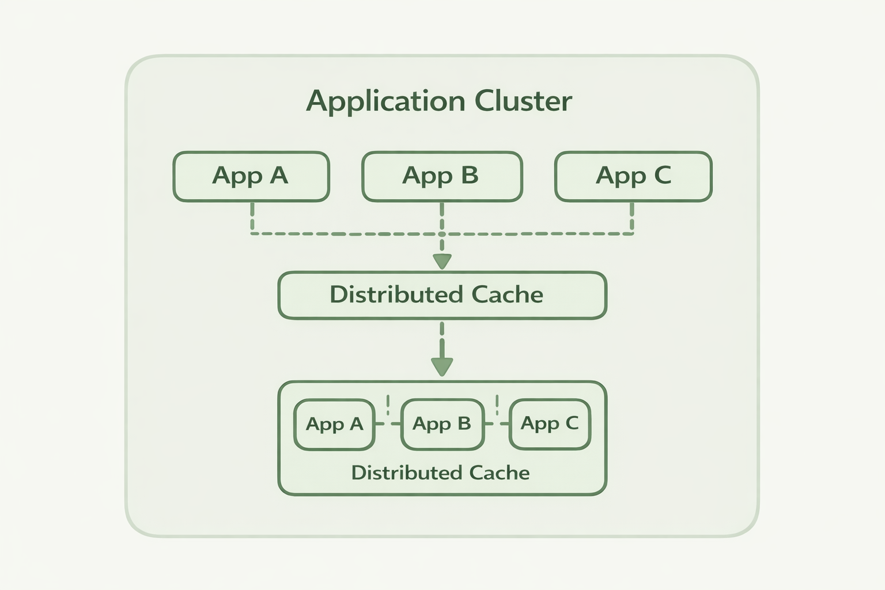

# Distributed Caching in .NET

Caching is one of the most effective ways to improve the performance of
an application.\
Most .NET applications start with a simple in‑memory cache using
`MemoryCache` or `IMemoryCache`. This works perfectly when the
application runs on a single server.

However, modern applications rarely run on a single machine.

When applications scale horizontally across multiple instances,
in‑memory caching stops working reliably. Each instance maintains its
own cache, which means the application state becomes inconsistent across
the cluster.

This is where **distributed caching** becomes essential.

------------------------------------------------------------------------




------------------------------------------------------------------------

# The Problem with In‑Memory Caches

Consider a typical ASP.NET application deployed behind a load balancer.

```
          Load Balancer
                |
     ---------------------------
     |            |            |
  Server A     Server B     Server C
```

Each server has its own memory cache.

If a request updates cached data on **Server A**, the caches on **Server
B** and **Server C** remain outdated.

This leads to several problems:

-   inconsistent application state
-   stale cache entries
-   duplicate cache warmups
-   unpredictable behavior

To solve this problem, the cache must be **shared across all nodes**.

------------------------------------------------------------------------

# What is a Distributed Cache?

A distributed cache is a **centralized or clustered cache** that can be
accessed by multiple application instances.

Instead of storing cached data inside the application process, the data
is stored in a **distributed key‑value store**.

```
           Application Nodes

        App A     App B     App C
          |         |         |
          +---------+---------+
                    |
            Distributed Cache
```

All application nodes read and write cache entries from the same
distributed store.

This ensures:

-   consistent cached data
-   shared application state
-   better scalability

------------------------------------------------------------------------

# Basic Distributed Cache Example in .NET

A distributed cache is typically used through an abstraction such as
`IDistributedCache`.

Example:

``` csharp
public class ProductService
{
    private readonly IDistributedCache _cache;

    public ProductService(IDistributedCache cache)
    {
        _cache = cache;
    }

    public async Task<string?> GetProductAsync(string id)
    {
        var cached = await _cache.GetStringAsync(id);

        if (cached != null)
            return cached;

        var product = await LoadProductFromDatabase(id);

        await _cache.SetStringAsync(id, product);

        return product;
    }

    private Task<string> LoadProductFromDatabase(string id)
    {
        return Task.FromResult($"Product {id}");
    }
}
```

The application first checks the cache. If the value is missing, the
data is loaded from the database and then stored in the cache.

This pattern is called **cache‑aside caching**.

------------------------------------------------------------------------

# Common Distributed Cache Solutions

Several technologies provide distributed caching capabilities.

## Redis

Redis is one of the most widely used distributed caches.

It provides:

-   key‑value storage
-   high performance
-   in‑memory operations

However, Redis often requires additional components when used for
distributed coordination.

------------------------------------------------------------------------

## Database‑Backed Caches

Some applications use relational databases as caches.

While simple, this approach introduces:

-   database contention
-   reduced performance
-   limited scalability

------------------------------------------------------------------------

## Distributed Key‑Value Platforms

Modern distributed systems often use **distributed key‑value platforms**
that provide both caching and coordination primitives.

These systems support:

-   distributed caching
-   distributed locks
-   leader election
-   change notifications
-   cluster coordination

------------------------------------------------------------------------

# Using Clustron as a Distributed Cache

Clustron provides a distributed key‑value platform designed for .NET
applications.

Because it runs as a distributed cluster, all application instances
interact with the same shared data store.

Example:

``` csharp
using Clustron.DKV.Client;

var client = await DKVClient.InitializeRemote(
    "teststore",
    new[]
    {
        new DkvServerInfo("localhost", 7861)
    });

await client.PutAsync("product:1", "Laptop");

var value = await client.GetAsync<string>("product:1");

Console.WriteLine(value);
```

In this example:

-   application nodes connect to the cluster
-   data is stored in the distributed store
-   all nodes see the same data

This allows the cache to remain **consistent across the entire
cluster**.

------------------------------------------------------------------------

# When to Use Distributed Caching

Distributed caching is especially useful in systems that:

-   run multiple application instances
-   process high request volumes
-   rely heavily on database reads
-   require shared application state

Typical use cases include:

-   ASP.NET web applications
-   microservices architectures
-   background processing systems
-   API platforms

------------------------------------------------------------------------

# Summary

In‑memory caching works well for single‑server applications, but modern
distributed systems require a shared caching layer.

Distributed caching allows multiple application instances to share the
same cached data, improving scalability and consistency.

Platforms such as Clustron provide a distributed key‑value store that
makes it easy to implement distributed caching and coordination in .NET
applications.
