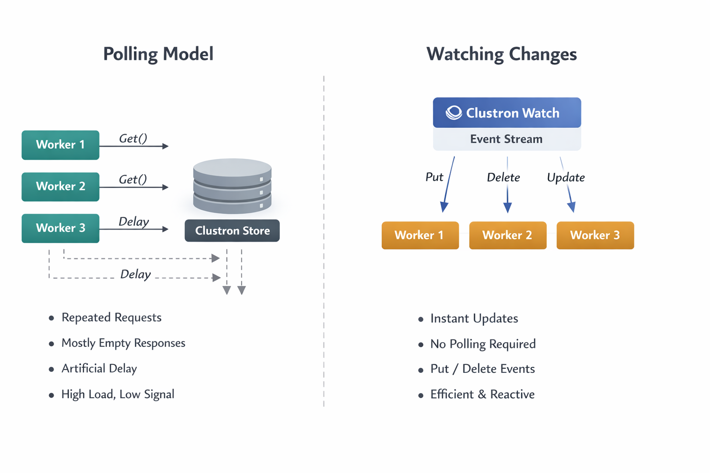

# Build Reactive Systems with Clustron Watch

Most distributed systems don’t start out complicated.

They begin with something simple — a loop.

You write a small worker that checks for work:

```csharp id="poll_loop"
while (true)
{
    var job = await client.GetAsync<Job>("jobs:next");

    if (job.IsSuccess)
    {
        await ProcessAsync(job.Value);
    }

    await Task.Delay(1000);
}
```

At this stage, everything feels reasonable. The logic is clear, the system behaves predictably, and there is very little cognitive overhead.

But as the system grows, this pattern quietly becomes one of the most expensive parts of your architecture.

---

## The Hidden Cost of Polling in Distributed Systems

Polling introduces a fundamental inefficiency: you are repeatedly asking the system for changes that usually haven’t happened.

As you scale:

* Multiple instances begin polling the same data
* Each instance performs repeated reads, most of which return no useful information
* You introduce artificial latency — changes are only detected on the next polling cycle
* The system starts consuming resources simply to confirm that nothing has changed

This leads to a system that is technically correct, but operationally inefficient.

More importantly, polling forces you to make tradeoffs you shouldn’t have to make:

* Poll frequently → higher cost, lower latency
* Poll less frequently → lower cost, higher latency

There is no correct answer — only compromise.

---

## A Different Model: Reacting Instead of Asking

The alternative is not just an optimization — it is a different way of thinking about systems.

Instead of asking:

> “Has something changed?”

You design your system to respond to:

> “Something just changed.”

This is the shift from a **pull-based model** to a **push-based model**.

In Clustron, this is implemented through Watch.

---



---

## Introducing Watch: A Stream of State Changes

Clustron Watch allows you to subscribe to changes in the system and receive events as they happen.

At its core, Watch turns your data into a **continuous stream of updates**.

### Watching a Single Key

```csharp id="watch_key"
var (subscription, initialRecord) = await client.Watch.WatchKeyAsync(
    "order:1001",
    new WatchOptions { IncludeInitialSnapshot = true },
    ev =>
    {
        Console.WriteLine($"{ev.EventType} → {ev.Key} = {ev.Value}");
    });
```

This does two important things:

1. It gives you the current state (`initialRecord`)
2. It subscribes you to all future changes

This combination is critical. Without it, you would have to manually fetch the current value and then subscribe — which introduces race conditions.

---

## Snapshot + Streaming: A Correctness Guarantee

One of the subtle but essential aspects of Watch is the ability to include an initial snapshot.

When `IncludeInitialSnapshot` is enabled:

* You receive the current value at the time of subscription
* You then receive all subsequent updates in order

This ensures that:

* You do not miss existing state
* You do not miss future changes
* You do not need additional synchronization logic

In other words, Watch provides a **complete and consistent view of state evolution**.

---

## Watching Collections: Moving Beyond Single Keys

While watching a single key is useful, most real systems operate on groups of related data.

Clustron supports this through prefix-based watching:

```csharp id="watch_prefix"
var subscription = await client.Watch.WatchPrefixAsync(
    "jobs:",
    new WatchOptions { IncludeInitialSnapshot = false },
    ev =>
    {
        Console.WriteLine($"Job update: {ev.Key}");
    });
```

This allows you to observe all changes within a logical group.

From an architectural perspective, this is where Watch becomes significantly more powerful:

* You are no longer reacting to individual values
* You are reacting to **system-wide state transitions**

---

## Understanding the Event Model

Each change in the system produces a `WatchEvent`.

A typical event contains:

* The key that changed
* The type of change (`Put` or `Delete`)
* The new value (if applicable)
* A revision representing the version of the change

This revision is particularly important. It provides ordering and allows you to reason about the sequence of events across a distributed system.

Effectively, Watch gives you a **log of state transitions**, delivered in real time.

---

## What This Enables in Practice

Once you adopt this model, several common problems become simpler.

### Job Processing

Instead of polling for new work, workers react immediately when jobs are created or updated.

This removes idle cycles and reduces latency.

---

### Cache Invalidation

Rather than relying on TTL or periodic refresh, caches can update themselves in response to actual changes.

This improves both freshness and efficiency.

---

### Distributed Coordination

Systems that rely on shared state — such as leader election or lease ownership — benefit significantly from real-time updates.

Changes propagate instantly, allowing faster and more reliable coordination.

---

### Presence and Monitoring

Tracking active components becomes trivial:

* When a node appears → you receive an event
* When a node disappears → you receive an event

No polling, no guessing.

---

## Operational Considerations

Watch is designed for long-running, event-driven workloads.

A few important considerations:

### Keep Handlers Lightweight

Your event handler should not perform heavy work directly.

Instead:

* Process quickly
* Delegate heavier tasks to background workers

---

### Manage Subscription Lifecycle

Always stop subscriptions when they are no longer needed:

```csharp id="stop_watch"
await subscription.StopAsync();
```

This ensures resources are released cleanly.

---

### Understand Scope

* Watching a key → only that key produces events
* Watching a prefix → only matching keys produce events

Events are scoped and isolated, which prevents unintended cross-talk between components.

---

## From Polling Loops to Reactive Systems

The shift from polling to watching is not just about performance.

It changes the structure of your application.

Polling systems are built around:

```text id="poll_model"
Loop → Check → Wait → Repeat
```

Reactive systems are built around:

```text id="reactive_model"
Event → Handler → Action
```

This results in systems that are:

* More responsive
* More efficient
* Easier to reason about

---

## Final Thoughts

Polling is often the simplest way to get started, and in small systems, it works well enough.

But as systems grow, the cost of polling becomes increasingly difficult to justify.

Clustron Watch offers a different approach — one where your system reacts to change rather than searching for it.

```text id="final_thought"
Stop asking your system if something changed.

Let it tell you when it does.
```

---

## Getting Started

Try a simple watch:

```csharp id="getting_started_watch"
await client.Watch.WatchPrefixAsync("orders:", null, ev =>
{
    Console.WriteLine($"{ev.Key} updated");
});
```

From there, start removing polling loops — one at a time.

You’ll quickly find that your system becomes not just faster, but fundamentally simpler.
